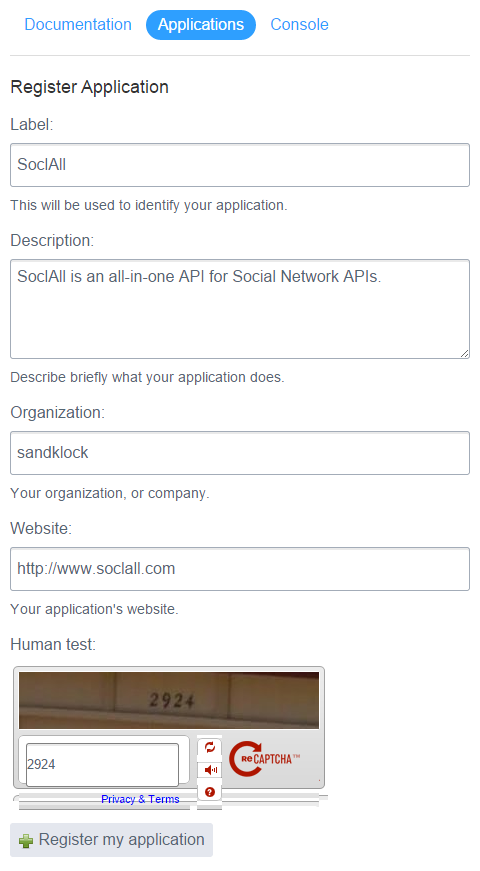
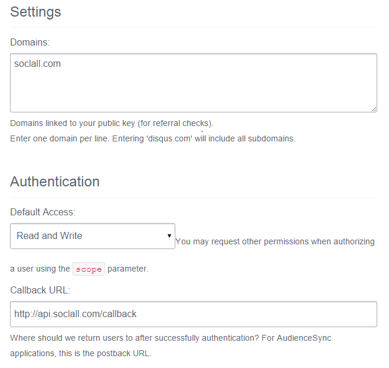
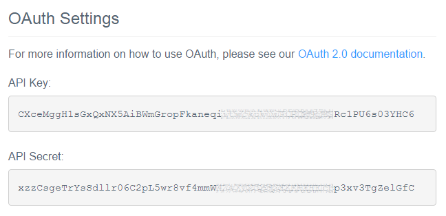

__To register an application on Disqus, please follow all steps below:__

1. Login to [Disqus](http://disqus.com/) and go to [Disqus Developer](https://disqus.com/api/applications/register/) Page to create application
2. Fill all information and press button "Register my application".
    

    
    

3. Go to Settings tab and fill below information
    * Domain: __soclall.com__
    * Callback URL: __http://api.soclall.com/callback__
    

    
    

4. In the Details tab, you can also get "API Key" and "API Secret" to fill SoclAll Disqus Settings form
    

    
    

